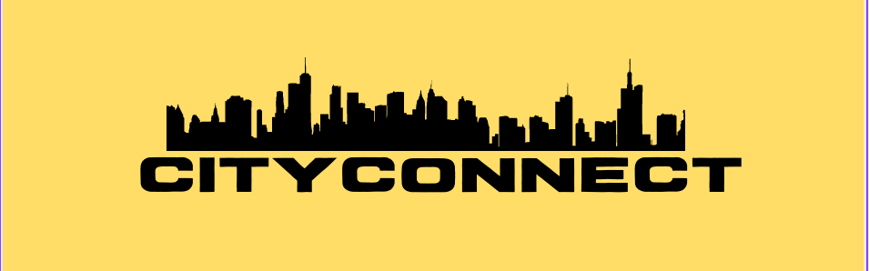

## CityConnect Forum

## A Decentralized Forum for city communities to post there greviences and get them resolved by the city officials.

**CityConnect** Forum is not just a platform; it's a dynamic and inclusive space where residents and officials collaboratively contribute to the betterment of their city, fostering a stronger sense of community and civic responsibility.built on **dataverse os**.

<br>

## Demo

### Home Page


<br>

Github : <a style="margin-bottom: 5px;" href="https://github.com/Novobloc/CityConnectForum-Dataverseos" target="_blank"> Repo Link </a>

Video : <a style="margin-bottom: 5px;" href="https://youtu.be/qgV1xddaLTc" target="_blank"> Youtube Link </a>

## Stack We Used

1. Frontend: We used **React JS**, Tailwind CSS for UI.

2. Blockchain :
   1. DataverseOS: We used **DataverseOS SDK** for storage and wallet.

## Steps to Run the Project

1. Clone the repo

```
git clone https://github.com/Novobloc/CityConnectForum-Dataverseos
```

2. Install the dependencies.

```
 yarn install
```

3. deploy dataverseos app

```
dataverse deploy

```

3. Start the app using command

```
yarn run dev
```

4. Open this link in browser http://localhost:5222

5. Hey, You just ran the code in your system, thats it.

<br>

## Meet Our Team

<div style="display: flex; justify-content: space-between; align-items: center;">
   <p style="flex:1">Shiva Kumar: </p>
   <div style="flex:4; justify-content: space-between;">
      <a href="https://www.linkedin.com/in/shivamangina/" target="_blank">
      
      </a>
      <a href="https://twitter.com/shivakmangina" target="_blank">
      
      </a>
      <a href="https://www.instagram.com/shiva_mangina" target="_blank">
      
      </a>
      <a href="https://github.com/shivamangina" target="_blank">
      
      </a>
   </div>
</div>

<div style="display: flex; justify-content: space-between; align-items: center;">
   <p style="flex:1">Sandeep Kumar: </p>
   <div style="flex:4; justify-content: space-between;">
      <a href="https://www.linkedin.com/in/satyasandeep" target="_blank">
      
      </a>
      <a href="https://twitter.com/satyasandeep76" target="_blank">
      
      </a>
      <a href="https://www.instagram.com/satyasandeep007" target="_blank">
      
      </a>
      <a href="https://github.com/satyasandeep007" target="_blank">
      
      </a>
   </div>
</div>
